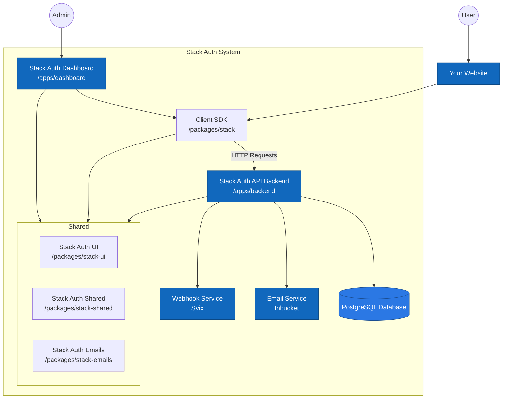

[](https://stack-auth.com)

<h3 align="center">
  <a href="https://docs.stack-auth.com">📘 Docs</a>
  | <a href="https://stack-auth.com/">☁️ Hosted Version</a>
  | <a href="https://demo.stack-auth.com/">✨ Demo</a>
  | <a href="https://discord.stack-auth.com">🎮 Discord</a>
</h4>

# Stack Auth: The open-source auth platform

Stack Auth is a managed user authentication solution. It is developer-friendly and fully open-source (licensed under MIT and AGPL).

Stack Auth gets you started in just five minutes, after which you'll be ready to use all of its features as you grow your project. Our managed service is completely optional and you can export your user data and self-host, for free, at any time.

We support Next.js, React, and JavaScript frontends, along with any backend that can use our [REST API](https://docs.stack-auth.com/api/overview). Check out our [setup guide](https://docs.stack-auth.com/docs/next/getting-started/setup) to get started.

<div align="center">

</div>

## Table of contents

<!-- START doctoc generated TOC please keep comment here to allow auto update -->
<!-- DON'T EDIT THIS SECTION, INSTEAD RE-RUN doctoc TO UPDATE -->

- [How is this different from X?](#how-is-this-different-from-x)
- [✨ Features](#-features)
- [📦 Installation & Setup](#-installation--setup)
- [🌱 Some community projects built with Stack Auth](#-some-community-projects-built-with-stack-auth)
  - [Templates](#templates)
  - [Examples](#examples)
- [🏗 Development & Contribution](#-development--contribution)
  - [Requirements](#requirements)
  - [Setup](#setup)
  - [Database migrations](#database-migrations)
  - [Chat with the codebase](#chat-with-the-codebase)
  - [Architecture overview](#architecture-overview)
- [❤ Contributors](#-contributors)

<!-- END doctoc generated TOC please keep comment here to allow auto update -->

## How is this different from X?

Ask yourself about `X`:

- Is `X` open-source?
- Is `X` developer-friendly, well-documented, and lets you get started in minutes?
- Besides authentication, does `X` also do authorization and user management (see feature list below)?

If you answered "no" to any of these questions, then that's how Stack Auth is different from `X`.

## ✨ Features

To get notified first when we add new features, please subscribe to [our newsletter](https://stack-auth.beehiiv.com/subscribe).

| | |
|-|:-:|
| <h3>`<SignIn/>` and `<SignUp/>`</h3> Authentication components that support OAuth, password credentials, and magic links, with shared development keys to make setup faster. All components support dark/light modes. |  |
| <h3>Idiomatic Next.js APIs</h3> We build on server components, React hooks, and route handlers. |  |
| <h3>User dashboard</h3> Dashboard to filter, analyze, and edit users. Replaces the first internal tool you would have to build. |  |
| <h3>Account settings</h3> Lets users update their profile, verify their e-mail, or change their password. No setup required. |  |
| <h3>Multi-tenancy & teams</h3> Manage B2B customers with an organization structure that makes sense and scales to millions. |  |
| <h3>Role-based access control</h3> Define an arbitrary permission graph and assign it to users. Organizations can create org-specific roles. |  |
| <h3>OAuth Connections</h3>Beyond login, Stack Auth can also manage access tokens for third-party APIs, such as Outlook and Google Calendar. It handles refreshing tokens and controlling scope, making access tokens accessible via a single function call. |  |
| <h3>Passkeys</h3> Support for passwordless authentication using passkeys, allowing users to sign in securely with biometrics or security keys across all their devices. |  |
| <h3>Impersonation</h3> Impersonate users for debugging and support, logging into their account as if you were them. |  |
| <h3>Webhooks</h3> Get notified when users use your product, built on Svix. |  |
| <h3>Automatic emails</h3> Send customizable emails on triggers such as sign-up, password reset, and email verification, editable with a WYSIWYG editor. |  |
| <h3>User session & JWT handling</h3> Stack Auth manages refresh and access tokens, JWTs, and cookies, resulting in the best performance at no implementation cost. |  |
| <h3>M2M authentication</h3> Use short-lived access tokens to authenticate your machines to other machines. |  |


## 📦 Installation & Setup

To install Stack Auth in your Next.js project (for React, JavaScript, or other frameworks, see our [complete documentation](https://docs.stack-auth.com)):

1. Run Stack Auth's installation wizard with the following command:
    ```bash
    npx @stackframe/init-stack@latest
    ```
   
   If you prefer not to open a browser during setup (useful for CI/CD environments or restricted environments):
    ```bash
    npx @stackframe/init-stack@latest --no-browser
    ```

2. Then, create an account on the [Stack Auth dashboard](https://app.stack-auth.com/projects), create a new project with an API key, and copy its environment variables into the .env.local file of your Next.js project:
    ```
    NEXT_PUBLIC_STACK_PROJECT_ID=<your-project-id>
    NEXT_PUBLIC_STACK_PUBLISHABLE_CLIENT_KEY=<your-publishable-client-key>
    STACK_SECRET_SERVER_KEY=<your-secret-server-key>
    ```
3. That's it! You can run your app with `npm run dev` and go to [http://localhost:3000/handler/signup](http://localhost:3000/handler/signup) to see the sign-up page. You can also check out the account settings page at [http://localhost:3000/handler/account-settings](http://localhost:3000/handler/account-settings).

Check out the [documentation](https://docs.stack-auth.com/getting-started/setup) for a more detailed guide.

## 🌱 Some community projects built with Stack Auth

Have your own? Happy to feature it if you create a PR or message us on [Discord](https://discord.stack-auth.com).

### Templates
- [Stack Auth Template by Stack Auth Team](https://github.com/stack-auth/stack-auth-template)
- [Next SaaSkit by wolfgunblood](https://github.com/wolfgunblood/nextjs-saaskit)
- [SaaS Boilerplate by Robin Faraj](https://github.com/robinfaraj/saas-boilerplate)

### Examples
- [Stack Auth Example by career-tokens](https://github.com/career-tokens/StackYCAuth)
- [Stack Auth Demo by the Stack Auth team](https://github.com/stack-auth/stack-auth/tree/dev/examples/demo)
- [Stack Auth E-Commerce Example by the Stack Auth team](https://github.com/stack-auth/stack-auth/tree/dev/examples/e-commerce)

## 🏗 Development & Contribution

This is for you if you want to contribute to the Stack Auth project or run the Stack Auth dashboard locally.

**Important**: Please read the [contribution guidelines](CONTRIBUTING.md) carefully and join [our Discord](https://discord.stack-auth.com) if you'd like to help.

### Requirements

- Node v20
- pnpm v9
- PostgreSQL 14+
- Redis 6+
- asdf (버전 관리)
- direnv (환경변수 관리)

### Setup (asdf + direnv + dev.sh 방식)

Docker 대신 로컬 개발환경을 사용합니다. 다음 단계를 따라 설정하세요:

#### 1. 필수 도구 설치 (macOS)

```bash
# asdf 설치
brew install asdf

# direnv 설치  
brew install direnv

# PostgreSQL 설치
brew install postgresql

# Redis 설치
brew install redis
```

#### 2. 개발환경 초기 설정

```bash
# 개발환경 자동 설정 (asdf 플러그인, Node.js, pnpm 설치)
./dev.sh setup
```

#### 3. 의존성 서비스 시작

```bash
# PostgreSQL과 Redis 서비스 시작
./dev.sh deps
```

#### 4. 개발 서버 시작

```bash
# 전체 개발 서버 시작
./dev.sh dev

# 또는 기본 서버만 (백엔드 + 대시보드, 리소스 절약)
./dev.sh dev:basic
```

### 개발 스크립트 사용법

```bash
./dev.sh help          # 도움말 표시
./dev.sh setup         # 개발환경 초기 설정
./dev.sh deps          # 의존성 서비스 시작
./dev.sh stop-deps     # 의존성 서비스 중지
./dev.sh dev           # 개발 서버 시작
./dev.sh dev:basic     # 기본 개발 서버 시작
./dev.sh build         # 프로젝트 빌드
./dev.sh test          # 테스트 실행
./dev.sh clean         # 빌드 파일 정리
./dev.sh db:init       # 데이터베이스 초기화
./dev.sh db:reset      # 데이터베이스 리셋
./dev.sh db:seed       # 시드 데이터 삽입
```

개발 런치패드는 [http://localhost:8100](http://localhost:8100)에서 접근할 수 있습니다. 여기서 대시보드(8101), API(8102), 데모(8103), 문서(8104) 등 모든 실행 중인 서비스에 접근할 수 있습니다.

IDE에서 `@stackframe/XYZ` 임포트 오류가 표시될 수 있습니다. 이를 해결하려면 TypeScript 언어 서버를 재시작하세요. VSCode에서는 명령 팔레트(Ctrl+Shift+P)를 열고 `Developer: Reload Window` 또는 `TypeScript: Restart TS server`를 실행하세요.

Prisma Studio를 사용하여 데이터베이스를 직접 관리할 수도 있습니다:

```sh
pnpm run prisma studio
```


### Database migrations

If you make changes to the Prisma schema, you need to run the following command to create a migration file:

```sh
pnpm run db:migration-gen
```

### Chat with the codebase

Storia trained an [AI on our codebase](https://sage.storia.ai/stack-auth) that can answer questions about using and contributing to Stack Auth.

### Architecture overview



Thanks to [CodeViz](https://www.codeviz.ai) for generating the diagram!

## ❤ Contributors

<a href="https://github.com/stack-auth/stack-auth/graphs/contributors">
  
</a>
